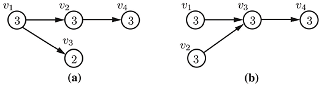

# Metrics

A number of predefined metrics for analyzing curricula and degree plans are described below. You may also define your own metrics for curricula and degree plans.  Each of these data types has a `metrics` dictionary where you may write these user-defined metrics.

## Curricular Metrics

```@docs
CurricularAnalytics
```

### Blocking Factor

The blocking factor is an important curriculum-based metric because it measures the extent to which one course blocks the ability to take other courses in the curriculum. That is, a course with a high blocking factor acts as a gateway to many other courses in the curriculum. Students who are unable to pass the gateway course will be blocked from taking many other courses in the curriculum.

We define the blocking factor of a course ``v_i`` as the number of courses in the graph that are reachable from ``v_i``. As examples of the blocking factor metric, conisder the two four-course curricula, with courses ``v_1, v_2, v_3`` and ``v_4``, shown below.  In part (a) of this figure, ``v_1`` is a prerequisite for courses ``v_2`` and ``v_3``, and ``v_2`` is a  prerequisite for course ``v_4``, while in part (b), courses ``v_1`` and ``v_2`` are prerequisites for course ``v_3``, and ``v_3`` is a prerequisite for course ``v_4``. The blocking factor of each course are shown inside of the course vertices in this figure.


```@docs
blocking_factor
```

### Delay Factor

Many curricula, particularly those in science, technology engineering and math (STEM) fields, contain a set of courses that must be completed in sequential order. The ability to successfully navigate these long pathways without delay is critical for student success and on-time graduation. If any course on the pathway is not completed on time, the student will then be delayed in completing the entire pathway by one term. The delay factor metric allows us to quanity this effect.

We define the delay factor of course vertex ``v_i`` to be the length of the longest path that contains ``v_i``. As an example of the delay factor metric, consider the same four-course curricula shown above. The delay factor of each course are shown inside of the course vertices in the figure below.



```@docs
delay_factor
```

### Centrality

A course can be thought of as central to a curriculum if it requires a number of foundational courses as prerequisites, and the course itself serves as a prerequisite to many additional discipline-specific courses in the curriculum. The centrality metric is meant to capture this notion.

We define the centrality of source and sink vertices to be 0.  For all other course vertices, consider all of the long paths (i.e., unique paths from a source to a sink) containing course vertex ``v_i``.  The centrality of ``v_i`` is given by the sum of these path lengths. As an example of the centrality metric, consider the same four-course curricula shown above. The centrality factor of each course are shown inside of the vertices in the figure below.


In the case of the curriculum in part (a), there is one long path of length three that includes course ``v_2``, hence its centrality is 3, while in part (b), there are two long paths of length three that include course ``v_2``, hence its centrality is 6.

```@docs
centrality
```

### Structural Complexity

The curricular complexity of a course is meant to capture the impact of curricular structure on student progression. Through experimentation, we have found that a simple linear combination of the delay and blocking factors provides a good measure for quantifying the structural complexity of a curriculum.

As an example of the structural complexity metric, consider the same four-course curricula shown above. The compleixty factor of each course, which is simply the sum of the course's delay and blocking factors, are shown inside of the course vertices in this figure.


```@docs
complexity
```

### Basic Metrics (Curriculum)

All of the predefined metrics for a given curriculum described above will be computed and stored in the curriculum's `metric` dictionary by using the following function.

```@docs
basic_metrics(::Curriculum)
```

## Degree Plan Metrics

The aforementioned curricular complexity metrics are independent of how a curriculum is layed out as a degree plan.  That is, the curricular metrics will not change as different degree plans are created.  Degree plan metrics are related to the manner in which courses in the curriculum are laid out across the terms in the degree plan.  These metrics are used in the creation of optimal degree plans as described in [Optimized Degree Plans](@ref).

### Basic Metrics (Degree Plans)

A set of basic statistics associated with the distribution of credit hours in a degree plan can be obtained by using:

```@docs
basic_metrics(::DegreePlan)
```

### Requisite Distance

A degree plan metric that is based upon the separation of courses and their pre- and co-requisites in a degree plan is described next.

```@docs
requisite_distance
```
